# Christmas Store Registration System - Architecture Diagrams

## System Architecture

## User Registration Flow

```mermaid
sequenceDiagram
    participant U as 👤 User
    participant RF as 📝 Registration Form
    participant API as 🔗 API Routes
    participant GQL as ⚡ GraphQL/AppSync
    participant DB as 🗄️ DynamoDB
    participant SES as 📮 Amazon SES
    participant SMS as 📱 Clearstream

    Note over U,SMS: Christmas Store Registration Process

    U->>RF: Visit registration page
    RF->>GQL: Load registration config
    GQL->>DB: Query RegistrationConfig
    DB-->>GQL: Return config data
    GQL-->>RF: Registration settings
    
    alt Registration Closed
        RF-->>U: Show "Registration Closed" message
    else Invite Only Mode
        U->>RF: Enter invite token
        RF->>API: Validate invite token
        API->>GQL: Query invitation
        GQL->>DB: Check token validity
        DB-->>API: Token validation result
        API-->>RF: Validation response
        
        alt Invalid Token
            RF-->>U: Show error message
        else Valid Token
            RF-->>U: Show registration form
        end
    else Open Registration
        RF-->>U: Show registration form directly
    end

    Note over U,SMS: Registration Submission

    U->>RF: Fill registration form
    RF->>API: Validate postal code
    API->>+Zippopotam: Check postal code
    Zippopotam-->>-API: Location data
    API-->>RF: Validation result

    U->>RF: Submit registration
    RF->>API: Submit registration data
    API->>GQL: Create registration mutation
    GQL->>DB: Store registration
    DB-->>GQL: Registration created
    GQL-->>API: Success response
    API-->>RF: Registration confirmed

    par Send Email Confirmation
        API->>SES: Send confirmation email
        SES-->>U: Email delivered
    and Send SMS Confirmation
        API->>SMS: Send SMS confirmation
        SMS-->>U: SMS delivered
    end

    RF-->>U: Show success message
```

## Admin Management Flow

```mermaid
flowchart TD
    A[🛡️ Admin Login] --> B{Authenticated?}
    B -->|No| C[🔐 Login with Cognito]
    B -->|Yes| D[⚙️ Admin Dashboard]
    
    C --> E{Login Successful?}
    E -->|No| F[❌ Show Error]
    E -->|Yes| D
    
    D --> G[📊 View Registrations]
    D --> H[⚙️ Update Settings]
    D --> I[📧 Send Invitations]
    D --> J[⏰ Manage Time Slots]
    
    G --> K[📋 Registration List]
    K --> L[📄 Export Data]
    K --> M[✏️ Edit Registration]
    
    H --> N[💌 Update Contact Info]
    H --> O[🎯 Toggle Registration Mode]
    H --> P[📅 Set Event Dates]
    
    I --> Q[📝 Create Invite Tokens]
    Q --> R[📧 Send Invite Emails]
    
    J --> S[➕ Add Time Slots]
    J --> T[✏️ Edit Time Slots]
    J --> U[❌ Delete Time Slots]
    
    %% Save actions
    N --> V[💾 Save to DynamoDB]
    O --> V
    P --> V
    S --> V
    T --> V
    M --> V
    
    V --> W[✅ Success Notification]
    
    %% Styling
    classDef adminClass fill:#e3f2fd
    classDef actionClass fill:#fff3e0
    classDef dataClass fill:#f1f8e9
    classDef successClass fill:#e8f5e8
    
    class A,C,D adminClass
    class G,H,I,J,K,L,M,N,O,P,Q,R,S,T,U actionClass
    class V dataClass
    class W successClass
```

## Data Model Relationships

## Security & Error Handling

```mermaid
flowchart TB
    subgraph "Security Layers"
        A[🔐 AWS Cognito Authentication]
        B[👑 Admin Group Authorization]
        C[🛡️ API Route Protection]
        D[✅ Zod Input Validation]
        E[🚫 Rate Limiting]
    end
    
    subgraph "Error Handling"
        F[📊 Standardized Error Responses]
        G[📝 Comprehensive Logging]
        H[🔄 Retry Mechanisms]
        I[❌ Graceful Degradation]
    end
    
    subgraph "Data Protection"
        J[🔒 Encrypted Data at Rest]
        K[🚦 HTTPS in Transit]
        L[🎭 No Sensitive Data in Logs]
        M[⏰ Token Expiration]
    end
    
    A --> B
    B --> C
    C --> D
    D --> E
    
    E --> F
    F --> G
    G --> H
    H --> I
    
    I --> J
    J --> K
    K --> L
    L --> M
    
    classDef securityClass fill:#ffebee
    classDef errorClass fill:#fff3e0
    classDef dataClass fill:#e8f5e8
    
    class A,B,C,D,E securityClass
    class F,G,H,I errorClass
    class J,K,L,M dataClass
```

